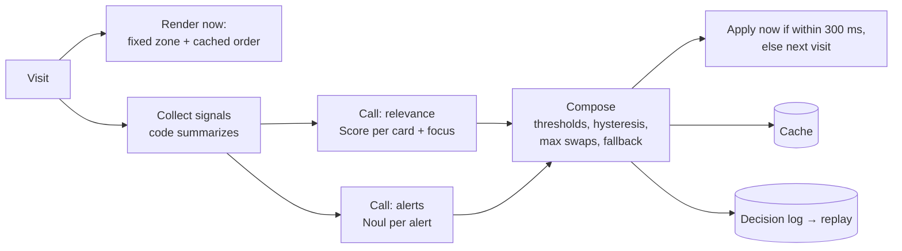

# reflexui

[](https://www.npmjs.com/package/@reflexui-jev/core)
[](LICENSE)
[](https://www.typescriptlang.org/)
[](https://nodejs.org/)

**Adaptive screens powered by Jev.** Screens that rearrange themselves around what matters right now, by reflex. A fast typed-judgment model decides *what* is relevant; your code decides *what is allowed*.

> **Status: pre-alpha.** This repository contains the structure, the types, and the design.
> Most orchestration functions are stubs that throw `not implemented yet (milestone Mx)`.
> See [Roadmap](#roadmap).

---

## Contents

- [Overview](#overview)
- [Quick start](#quick-start)
- [Why](#why)
- [How it works](#how-it-works)
- [Core concepts](#core-concepts)
- [Project structure](#project-structure)
- [Packages](#packages)
- [Usage](#usage)
- [Configuration](#configuration)
- [Providers](#providers)
- [Examples](#examples)
- [Design principles](#design-principles)
- [Development](#development)
- [Roadmap](#roadmap)
- [Privacy](#privacy)
- [Contributing](#contributing)
- [License](#license)
- [Prior art](#prior-art)

---

## Overview

**reflexui** is a TypeScript monorepo for adaptive UI surfaces. Every card, alert, and suggestion already exists in your code with values you compute. A System One model such as [Jev](https://typesafe.ai/blog/introducing-system-one-models-and-jev) only *ranks, gates, and picks* among those items—returning typed answers with calibrated confidence in roughly 70–500 ms—while a policy layer in code applies thresholds, stability rules, and fallbacks.

Goal: screens that adapt to the moment, never show invented content, and never block rendering on the model.

| | |
| --- | --- |
| **Language** | TypeScript (ESM) |
| **Runtime** | Node.js 20+ |
| **Package manager** | pnpm 10 |
| **License** | MIT |
| **Published packages** | `@reflexui-jev/core`, `@reflexui-jev/providers`, `@reflexui-jev/react`, `@reflexui-jev/replay` |

---

## Quick start

1. **Install** (pre-alpha; published on npm as `0.1.0`):

   ```bash
   pnpm add @reflexui-jev/core
   # optional:
   pnpm add @reflexui-jev/providers
   pnpm add @reflexui-jev/react react   # peer: react >= 18
   ```

2. **Define a surface** with `defineSurface()` (types and definition helpers are ready today).

3. **Run decisions** with `decide()` once milestone **M1** lands (currently a stub). Until then, use `defaultDecision()` for a deterministic fallback order, or `mockDecider()` for local experiments without an API key.

4. **Configure a provider** (optional) by copying the env template:

   ```bash
   cp .env.example .env
   ```

Without any key, examples are intended to run with the mock decider.

For local work on this repository:

```bash
pnpm install
pnpm typecheck
pnpm build
```

---

## Why

Most dashboards show the same grid to everyone. The one number that needs attention today (late deliveries, a unit falling behind, a spike in churn risk) sits below the fold next to ten numbers that did not change.

Generative UI with LLMs can rebuild a screen per user, but it is slow (seconds), expensive, and can invent labels and numbers. **reflexui** takes a narrower path:

- every card, alert, and suggestion **already exists** with values computed by your code;
- a **System One model** such as [Jev](https://typesafe.ai/blog/introducing-system-one-models-and-jev) only *ranks, gates, and picks* among them;
- a **policy layer** in code applies thresholds, stability rules, and fallbacks.

The result: a screen that adapts to the moment, never shows invented content, and never blocks rendering on the model.

---

## How it works

A surface has two zones:

| Zone | Who decides | Changes when |
| --- | --- | --- |
| **Fixed zone** (first scroll) | Your code, from the subject's profile | The profile changes |
| **Adaptive zone** | The model ranks; the policy limits | Signals change; max N swaps per visit |

One visit:



The two model calls run in parallel. Each receives only the signals its questions need.

---

## Core concepts

| Concept | What it is | Where |
| --- | --- | --- |
| **Surface** | A screen definition: fixed zone, default order, items, signals, rubric, policy | `defineSurface()` |
| **Item** | A `card`, an `alert`, or a `suggestion`, with an eligibility rule and reason templates | `SurfaceItem` |
| **Signal** | A provider that turns raw data into a short, model-ready snapshot + structured facts | `SignalProvider` |
| **Question** | A typed question: `score` (rubric), `choice` (options), or `noul` (yes/no probability) | `score()`, `choice()`, `noul()` |
| **Decider** | Anything that answers typed questions: Jev via a gateway, an LLM, a mock | `Decider` |
| **Policy** | Thresholds and stability rules, all in code | `Policy`, `defaultPolicy` |
| **Decision** | What to render: fixed ids, ranked adaptive items, at most one alert, suggestions, reasons | `Decision` |
| **Replay** | Run the surface over labeled history and compare with the default order | `runReplay()` |

Full reference: [docs/concepts.md](docs/concepts.md).

---

## Project structure

```
packages/
  core/          # Types, questions, defineSurface, policy, compose, decide, stores
  providers/     # Deciders: mock, TypeSafe, Cloudflare, OpenRouter, LLM fallback
  react/         # Headless useAdaptiveSurface + feedback
  replay/        # Offline replay over labeled history
examples/
  restaurant-kpis/   # Restaurant owner home (fictitious "Mesa Boa")
  saas-dashboard/    # Small B2B SaaS admin surface (domain-isolation check)
docs/
  concepts.md
  architecture.md
  writing-questions.md
  privacy.md
```

---

## Packages

| Package | Purpose | Status |
| --- | --- | --- |
| [`@reflexui-jev/core`](packages/core) | Types, question builders, `defineSurface`, policy, `compose`, `decide`, stores | Types ready · logic M1 |
| [`@reflexui-jev/providers`](packages/providers) | Deciders for TypeSafe, Cloudflare, OpenRouter, an LLM fallback, and a deterministic mock | Mock ready · remote M0–M1 |
| [`@reflexui-jev/react`](packages/react) | Headless `useAdaptiveSurface` and feedback helpers | M1 |
| [`@reflexui-jev/replay`](packages/replay) | Offline replay: hit rate vs default order, latency, cost | M2 |

---

## Usage

### Define a surface

`defineSurface()` is implemented today. This sketch matches the public API used in [`examples/restaurant-kpis`](examples/restaurant-kpis):

```ts
import { defineSurface } from "@reflexui-jev/core";

export const home = defineSurface<RestaurantCtx>({
  id: "restaurant-home",
  fixed: (c) =>
    c.units >= 2
      ? ["revenue", "orders", "avg-ticket", "revenue-per-unit"]
      : ["revenue", "orders", "avg-ticket", "avg-rating"],
  defaultOrder: () => ["delivery-time", "cancellation-rate", "rating-trend", "top-dishes"],
  items: [
    {
      id: "delivery-time",
      kind: "card",
      area: "delivery",
      title: "Total delivery time",
      eligible: (c) => c.hasDelivery,
      reasons: [{ when: "anomaly", text: "{metric} is {ratio}x the 28-day average" }],
    },
    {
      id: "alert-late-delivery",
      kind: "alert",
      area: "delivery",
      title: "Late-delivery complaints",
      question: "Do recent reviews point to a late-delivery problem?",
    },
    // ...
  ],
  signals: [metricsSignal, navigationSignal, chatSignal, reviewsSignal],
  relevanceLevels: [
    "Nothing changed in this area and the owner showed no recent interest in it.",
    "The owner looked at or asked about this area recently, but the numbers are normal.",
    "Numbers moved out of the normal range, or it keeps coming up in reviews or chat.",
    "There is an active problem in this area that needs action today.",
  ],
  relevancePrompt: 'How important is it for the owner to see "{title}" today?',
});
```

### Decide on the server (planned — milestone M1)

```ts
import { decide, MemoryStore } from "@reflexui-jev/core";
import { cloudflareDecider } from "@reflexui-jev/providers";

const { immediate, fresh } = decide({
  surface: home,
  ctx,
  subjectId: ctx.restaurantId,
  decider: cloudflareDecider(),
  store: new MemoryStore(),
});
```

`decide()` currently throws `not implemented yet (milestone M1)`. Until then, `defaultDecision()` returns a deterministic decision from the surface's `defaultOrder`.

### Consume on the client (planned — milestone M1)

```tsx
import { useAdaptiveSurface } from "@reflexui-jev/react";

const { decision, status, feedback } = useAdaptiveSurface({
  surfaceId: "restaurant-home",
  subjectId,
  endpoint: "/api/surface",
});
```

The hook is a stub today: it returns `status: "loading"` and an empty `feedback` function until M1.

### Fallback without the model (available today)

```ts
import { defaultDecision, defineSurface } from "@reflexui-jev/core";

const decision = defaultDecision(home, ctx, subjectId, Date.now());
// decision.source === "default"
```

---

## Configuration

Copy [`.env.example`](.env.example) and fill in **at most one** provider. Without any key, use `mockDecider()`.

```bash
cp .env.example .env
```

| Variable | Provider | Notes |
| --- | --- | --- |
| `TYPESAFE_API_KEY` | `typesafeDecider` | TypeSafe direct (early access) |
| `CLOUDFLARE_ACCOUNT_ID` + `CLOUDFLARE_API_TOKEN` | `cloudflareDecider` | Workers AI model `typesafe/jev` |
| `OPENROUTER_API_KEY` | `openrouterDecider` | Model `typesafe/jev-1.13` |
| `LLM_API_KEY` | — | Documented for an LLM fallback; `llmDecider` takes a `generateObject` function in code |

Never commit `.env`. Replay datasets under `replay-data/` are git-ignored on purpose.

---

## Providers

| Provider | Model / backend | Status |
| --- | --- | --- |
| `mockDecider` | Deterministic hash | Ready — runs examples and tests with no API key |
| `typesafeDecider` | Jev (TypeSafe direct) | M0 (stub) |
| `cloudflareDecider` | `typesafe/jev` on Workers AI | M0 (stub) |
| `openrouterDecider` | `typesafe/jev-1.13` | M1 (stub) |
| `llmDecider` | Any LLM with structured output | M1 (stub); slower, uncalibrated |

```ts
import { mockDecider } from "@reflexui-jev/providers";

const decider = mockDecider({
  // optional: force answers for specific question keys
  overrides: {},
  latencyMs: 0,
});
```

---

## Examples

| Example | Domain | Shows |
| --- | --- | --- |
| [`examples/restaurant-kpis`](examples/restaurant-kpis) | Restaurant owner home | 19 cards, 5 alerts, 6 suggestions; 3 fictitious restaurants (delivery-first, dine-in bistro, 3-unit chain) |
| [`examples/saas-dashboard`](examples/saas-dashboard) | B2B SaaS admin home | Same core, different domain — proof that nothing is restaurant-specific |

Both examples define surfaces and fixtures today. An interactive Next.js demo is planned for **M1**, defaulting to `mockDecider`.

---

## Design principles

1. **Known rules stay in code.** If a structured field decides it, it is an `if`, not a question.
2. **The model never computes.** Deltas, averages, and dates are computed before the call.
3. **The model only chooses among what exists.** No model output becomes text on screen.
4. **Small context per call.** Each call gets only the signals its questions need.
5. **One question, one dimension.** Rubric levels describe situations, not adjectives.
6. **Stability over cleverness.** Fixed first scroll, few swaps per visit, hysteresis, pins.
7. **There is always a fallback.** Cache → default order → static screen. Never an empty slot.
8. **Every decision is explainable and logged.** Reasons come from templates; logs feed replay.

More: [docs/writing-questions.md](docs/writing-questions.md) · [docs/architecture.md](docs/architecture.md).

---

## Development

Requirements: **Node.js ≥ 20**, **pnpm 10** (see `packageManager` in the root `package.json`).

```bash
pnpm install      # install workspace deps
pnpm typecheck    # tsc --noEmit across the workspace
pnpm build        # build all packages (tsup)
pnpm changeset    # add a Changesets entry before release
```

`pnpm test` is wired at the root (`pnpm -r test`) for when packages add test scripts; none ship tests yet.

CI (`.github/workflows/ci.yml`) runs `pnpm install --frozen-lockfile`, `pnpm typecheck`, and `pnpm build` on `main` and pull requests.

---

## Roadmap

| Milestone | Scope | Exit criterion |
| --- | --- | --- |
| **M0** Access | Remote deciders for TypeSafe and Cloudflare | Real answers from Jev in an integration test |
| **M1** Core + mock demo | `compose`, `decide`, `buildRequests`, React hook, restaurant demo | Demo runs with `mockDecider`, no API key |
| **M2** Replay | `runReplay`, labeling format, report | Report shows hit rate vs default order |
| **M3** First production case | Integration behind a flag, feedback, logs | p95 ≤ 500 ms, no instability complaints |
| **M4** Field test | A/B against the static screen | Decision: ship, adjust, or stop |

---

## Privacy

- Signals are summarized **before** leaving your system; send the smallest useful context.
- Remove personal data (names, phones, emails, tax ids, addresses) from chat and reviews first.
- Prefer providers with zero data retention.
- Replay datasets are git-ignored (`replay-data/`). Never commit real customer data.

Details: [docs/privacy.md](docs/privacy.md).

---

## Contributing

The API is still moving. Open an issue before large PRs. See [CONTRIBUTING.md](CONTRIBUTING.md).

```bash
pnpm install
pnpm typecheck
```

Guidelines in short:

- Keep the core **domain-free** — restaurant/SaaS specifics belong in `examples/`.
- Keep `compose` **pure** — no I/O; time comes in as `now`.
- Use **fictitious fixtures only**.

---

## License

[MIT](LICENSE)

---

## Prior art

- [json-render + Jev](https://json-render.dev/docs/jev) (Vercel Labs): composes UI specs from candidates with Jev.
- [jev-ui](https://github.com/etweisberg/jev-ui): `<Branch>`, `<Rank>`, `<Gate>` components backed by Jev.
- [Introducing System One models and Jev](https://typesafe.ai/blog/introducing-system-one-models-and-jev) (TypeSafe).

reflexui differs by adapting **over time and across signals** (navigation, conversations, feedback, metrics), with stability rules and offline replay built in.
